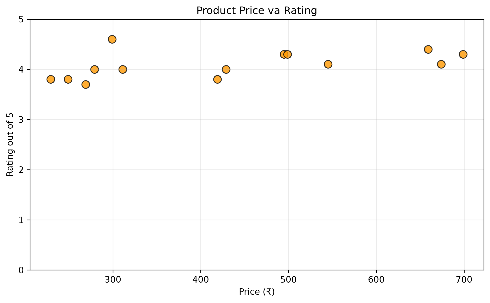

# Amazon Web Scraper Analysis

A beginner-friendly data analytics project that collects Amazon India wireless-mouse search results and analyzes product prices, ratings, and customer-review counts.

## Project Objective

The objective is to create a complete data pipeline using Python:

1. Request an Amazon search-results page.
2. Extract product information with BeautifulSoup.
3. Clean and organize the data with Pandas.
4. Export the cleaned dataset to CSV.
5. Analyze prices, ratings, and review counts.
6. Visualize the relationship between price and rating.

## Technologies Used

* Python
* Jupyter Notebook
* Requests
* BeautifulSoup
* Pandas
* Matplotlib

## Dataset Columns

* `asin`
* `title`
* `price_inr`
* `rating_out_of_5`
* `review_count`
* `product_url`
* `search_query`
* `page`
* `collected_at_utc`

## Key Findings

* Total products collected: 16
* Products with valid prices: 14
* Average price: ₹432.50
* Price range: ₹229–₹699
* Average rating: 4.06 out of 5
* Price-rating correlation: 0.51
* Highest rating: 4.6
* Most-reviewed product: Logitech B170 with 79,062 ratings
* Lowest-priced recommended product: Portronics Toad 23 at ₹279

The correlation suggests a moderate positive relationship between price and rating in this small dataset. It does not prove that higher prices cause better ratings.

## Visualization



## Project Files

* `Amazon_Wireless_Mouse_Analysis.ipynb` — complete scraping and analysis workflow
* `amazon_wireless_mouse.csv` — cleaned product dataset
* `amazon_price_vs_rating.png` — price-versus-rating visualization

## How to Run

Install the required libraries:

```bash
pip install requests beautifulsoup4 lxml pandas matplotlib
```

Open `Amazon_Wireless_Mouse_Analysis.ipynb` in Jupyter Notebook and run the cells from top to bottom.

## Responsible Use

This project is intended only for learning and small personal experiments. Amazon may change its website structure or block automated requests. The scraper does not bypass CAPTCHAs, authentication, or access restrictions. For production projects, use Amazon’s official Product Advertising API.

## Author

Srujyoti Maharana
